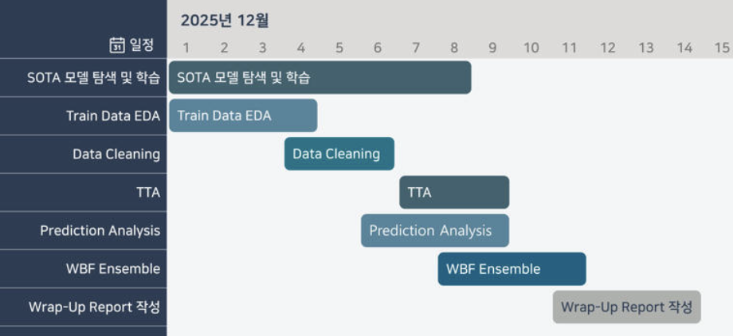

# 재활용 품목 분류를 위한 Object Detection

## 1. 프로젝트 개요


대량 생산/소비 시대의 '쓰레기 대란' 문제에 직면하여, 환경 부담을 줄이기 위한 분리수거의 중요성이 강조되고 있습니다. 정확한 분리배출이 재활용률을 높이는 핵심이므로, 이미지 내의 다양한 쓰레기 객체를 정확히 탐지하고 분류하는 Object Detection 모델을 개발하여 이 문제를 해결하고자 했습니다.

목표 : 이미지 내 10가지 종류의 쓰레기 객체의 위치(Bounding Box)와 클래스를 정확하게 예측하는 모델 개발

클래스 : General Trash, Paper, Paper pack, Metal, Glass, Plastic, Styroform, Plastic bag, Battery, Clothing

### 프로젝트 구조

**Overall Structure**


**Repo**

```
pro-cv-objectdetection-cv-12/
├── dataset
│   ├── train
│   ├── valid
│   └── test
├── cascade_rcnn
│   ├── inference.py
│   ├── swin.py
│   └── mmdetection
├── D-FINE
│   ├── D-FINE_inference.ipynb
│   ├── train.py
│   └── train_origin.py
├── DEIMv2_1
│   ├── DEIM_inference.ipynb
│   └── train.py
├── DEIMv2_2
│   ├── DEIM_inference.ipynb
│   ├── DEIM_inference_TTA.ipynb
│   └── train.py
├── yolo12x
│   └── yolo12x_Iterative_Stratification.ipynb
├── RF-DETR
│   ├── rfdetr_inference.ipynb
│   ├── rfdetr_train.ipynb
│   └── train_val_split.ipynbest_check.ipynb
│   ├── train_val_split.ipynb
│   └── wbf.ipynb
└── EDA
    ├── EDA_test.ipynb
    └── EDA_train.ipynb
```

**개발 환경**

-   하드웨어 : GPU 서버(V100)

-   운영체제 : Linux

-   주요 라이브러리 및 프레임워크 : PyTorch, MMDetection, Detectron2, Pandas, Numpy

**협업 Tool**

-   실험 관리 및 추적 : wandb, Notion
-   팀 커뮤니케이션 : Slack, Zoom

### Contributor

| 팀원                                                         | 역할                                                         |
| ------------------------------------------------------------ | ------------------------------------------------------------ |
| <br />[김범진](https://github.com/kimbum1018) | 목표 설정 및 리딩, RF-DETR, D-FINE, DEIMv2 모델 튜닝 및 실험 |
| <br />[김준수](https://github.com/0129jonsu) | PyTorch 베이스라인 설정, yolo12x, DEIMv2 모델 설계 및 실험   |
| <br />[김한준](https://github.com/hanjun0126) | MMDetection 베이스라인 설정, cascader rcnn 모델 설계 및 실험 |
| <br />[남현지](https://github.com/yujh5537) | Train Data EDA, Prediction Analysis, 앙상블 전략 설계        |
| <br />[송예림](https://github.com/SongYerim) | Train Data EDA, Prediction Analysis, 앙상블 전략 설계        |


### 프로젝트 수행 절차 및 방법




### Leaderboard Score

**Public**


**Private**


## Reference

프로젝트에 대한 자세한 내용 및 실험 결과는 [Wrapup-Report](https://drive.google.com/file/d/1IfaxKJvA1vDrNyw19lI8GyTUCF0vhZBq/view?usp=share_link) 에서 확인 가능합니다.